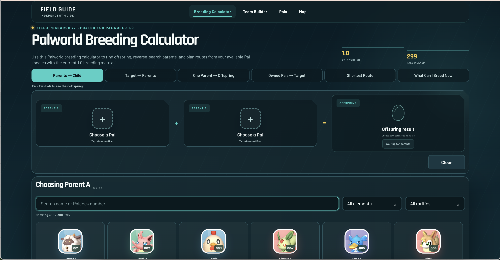

# Palworld Breeding Calculator

Plan your Pal breeding combos easily.

## About

Palworld Breeding Calculator helps players plan breeding combinations and find the most useful paths to their desired Pals. It makes breeding research faster by turning complex combinations into a clear, practical planning workflow.

## Features

- Explore Pal breeding combinations.
- Plan efficient paths toward a desired Pal.
- Compare potential parent combinations.
- Quickly access a free, browser-based breeding planning tool.

## Live Demo

Try the live tool at [palworldguide.net](https://palworldguide.net) - it's free and no signup needed.

## Screenshots

## License

MIT
